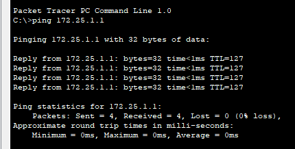

Dans cette note nous n'aborderons pas les liens trunks.
La note des liens trunks sera bientôt disponible.

On commence par la configuration des ordinateurs ainsi que du switch.


Nous nous rendons sur le Switch afin de créer deux VLANs (10, 20) :
```IOS
Switch> en
Switch# conf t
Switch(config)# vlan 10
Switch(config)# ex
Switch(config)# vlan 20
Switch(config)# ex
```

Une fois les VLANs créé on assigne les ports aux VLANs : 
```IOS
Switch(config)# int fa0/1
Switch(config-if)# switchport mode access
Switch(config-if)# swtichport access vlan 10
Switch(config-if)# ex
Switch(config)# int fa0/2
Switch(config-if)# switchport mode access
Switch(config-if)# swtichport access vlan 20
```

Ensuite on va se rendre sur cette note :
- [[Comment faire un lien trunk]]

Une fois le lien trunk réalisé on va pouvoir ajouter un routeur : 


Une fois rajouté on active le port côté router :
```IOS
Routeur> en
Routeur# conf t
Routeur(config)# int Gi0/0
Routeur(config-if)# no shut
Routeur(config-if)# ex
```

Une fois cela fait on commence la configuration du router : 
```IOS
Routeur(config)# int gi0/0.1
Routeur(config-subif)# encapsulation dot1Q 10
Routeur(config-subif)# ip address 172.16.254.254 255.255.0.0
Routeur(config-subif)# ex
Routeur(config)# int gi0/0.2
Routeur(config-subif)# encapsulation dot1Q 20
Routeur(config-subif)# ip address 172.25.254.254 255.255.0.0
```
